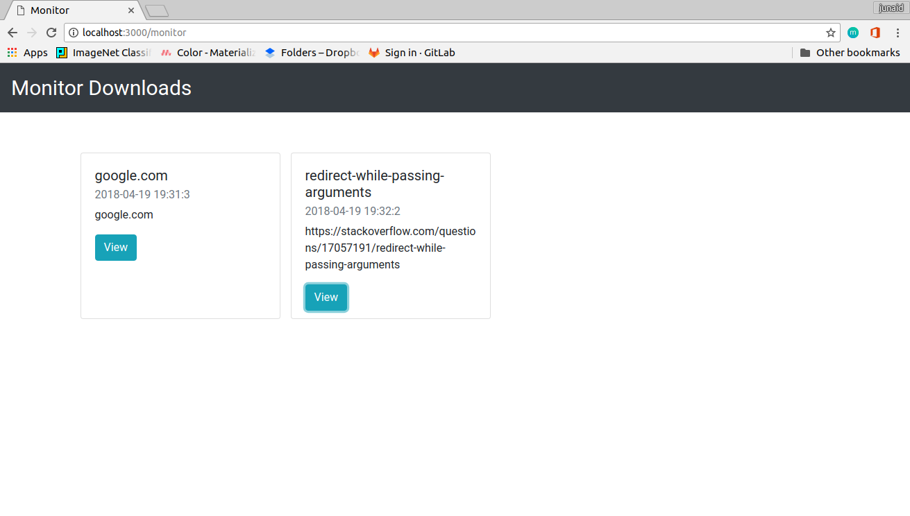
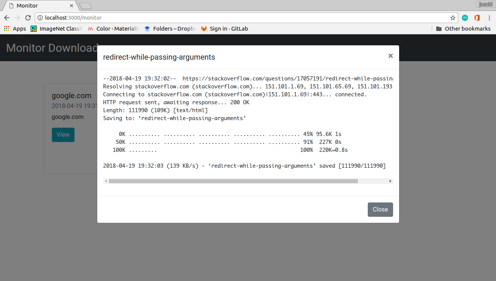

# DownloadGator

### Simplest Web App to Start a file download remotely on the server. Could be used by college students who have limited internet access in their colleges to remotely put stuff to download on a server hosted at home(tv shows and stuff). Server can be hosted using [ngrok](https://ngrok.com/) and connecting it to a Telegram Bot can notify about Server activities

## How to Start ?

#### Dependencies:
1. Flask
2. Wget (built-in in linux, need to install on windows)
3. Python 3

To clear the `Downloads/` folder and reset the `Downloads/downloads.json` file, run the `reset_downloads.sh` file on the server by either
1.  `sh reset_downloads.sh`  or
2.  `./reset_downloads.sh` (make it executable before running)

Just run the `main.py` file and the server should start on `localhost:3000`

## Features to be Added:

1.  Cancel a particular Download
2.  Alert whether Download was started or not
3.  Server Download Speed Data
4.  Telegram Bot Support

## Screenshots

> 

> 

> 