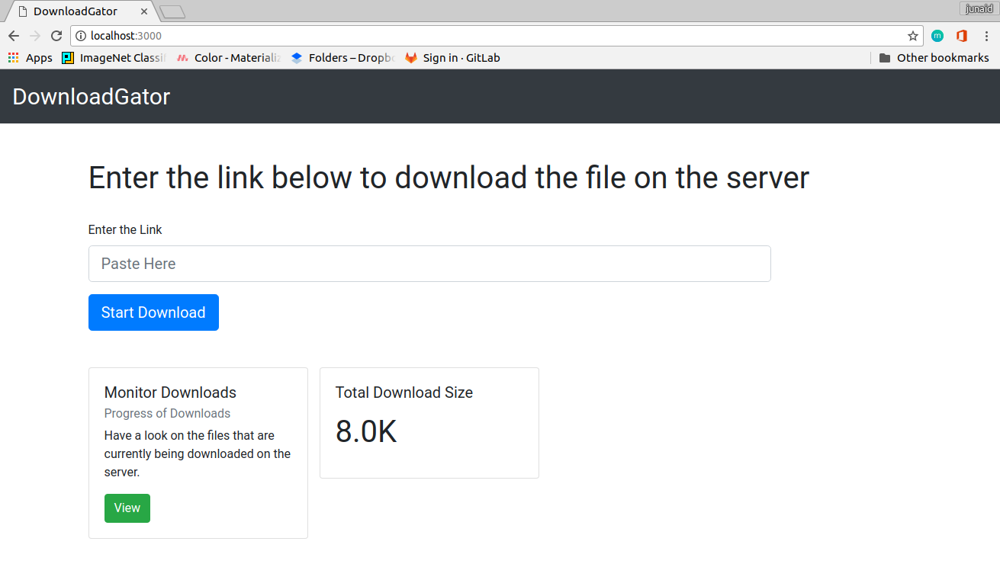

# DownloadGator

### Simplest Web App to Start a file download remotely on the server

### Could be used by college students who have limited internet access in their colleges to remotely put stuff to download on a server hosted at home

### Server can be hosted using ngrok and connecting it to a Telegram Bot can notify about Server activities

## Screenshots

> 